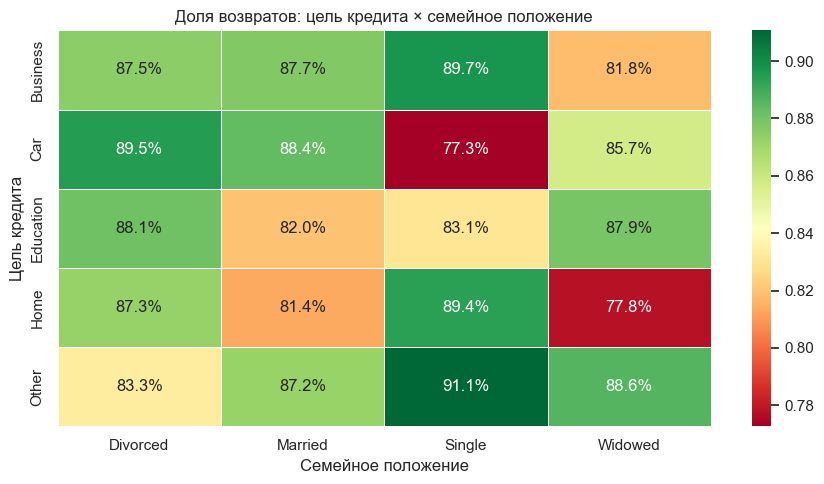

# Что влияет на возврат кредита: анализ 1 000 займов

Выпускной проект курса «Аналитик данных» (BELHARD, 2026).

**Задача:** по данным о клиентах и кредитах понять, какие признаки связаны с дефолтом,
и отделить реальные закономерности от случайных различий.

**Стек:** SQL (PostgreSQL / Supabase) · Python: pandas, seaborn, SciPy, statsmodels.



## Что сделано
- Витрина данных SQL-запросом (JOIN двух таблиц) и агрегат доли возвратов по группам (`GROUP BY`).
- Пропуски в доходе и стаже (22%) заполнены медианой внутри групп.
- Описательный анализ: сводные таблицы, распределения, корреляции.
- Статистическая проверка: χ², логистическая регрессия, двухфакторный дисперсионный анализ,
  тест Тьюки, точечно-бисериальная корреляция, проверка нормальности (Колмогоров — Смирнов).

## Результат
- Цель кредита и семейное положение на дефолт **статистически не влияют** (все p > 0,05),
  хотя в сводной таблице доля возвратов по группам колеблется от 77% до 91%.
- Доход, возраст, сумма кредита, стаж и число детей с дефолтом не связаны.
- Единственный значимый, но слабый фактор — **срок кредита** (r ≈ 0,09, p ≈ 0,005, d Коэна ≈ 0,25).
- Вывод: доступных признаков недостаточно для скоринга — нужны кредитная история,
  долговая нагрузка или выборка больше.

## Как запустить
```bash
pip install -r requirements.txt
jupyter notebook loan_default_analysis.ipynb
```

Данные учебные, выданы в рамках курса: `data/loans.csv`.
